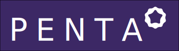

<h1 align="center"> Official Go implementation of the Penta Chain protocol.  </h1>  

  

<h2 align="center">
  The Universal Blockchain Connector
</h2>

## Contribution

Thank you for considering to help out with the source code! We welcome contributions from
anyone on the internet, and are grateful for even the smallest of fixes!

If you'd like to contribute to penta, please fork, fix, commit and send a pull request
for the maintainers to review and merge into the main code base. If you wish to submit more
complex changes though, please check up with the core devs first on [our gitter channel](https://gitter.im/penta-global/penta)
to ensure those changes are in line with the general philosophy of the project and/or get some
early feedback which can make both your efforts much lighter as well as our review and merge
procedures quick and simple.

Please make sure your contributions adhere to our coding guidelines:

 * Code must adhere to the official Go [formatting](https://golang.org/doc/effective_go.html#formatting) guidelines (i.e. uses [gofmt](https://golang.org/cmd/gofmt/)).
 * Code must be documented adhering to the official Go [commentary](https://golang.org/doc/effective_go.html#commentary) guidelines.
 * Pull requests need to be based on and opened against the `master` branch.
 * Commit messages should be prefixed with the package(s) they modify.
   * E.g. "penta, rpc: make trace configs optional"

Please see the [Developers' Guide](https://github.com/pentaglobal/documentation)
for more details on configuring your environment, managing project dependencies and testing procedures.

## License

The penta library (i.e. all code outside of the `cmd` directory) is licensed under the
[GNU Lesser General Public License v3.0](https://www.gnu.org/licenses/lgpl-3.0.en.html), also
included in our repository in the `COPYING.LESSER` file.

The penta binaries (i.e. all code inside of the `cmd` directory) is licensed under the
[GNU General Public License v3.0](https://www.gnu.org/licenses/gpl-3.0.en.html), also included
in our repository in the `COPYING` file.

